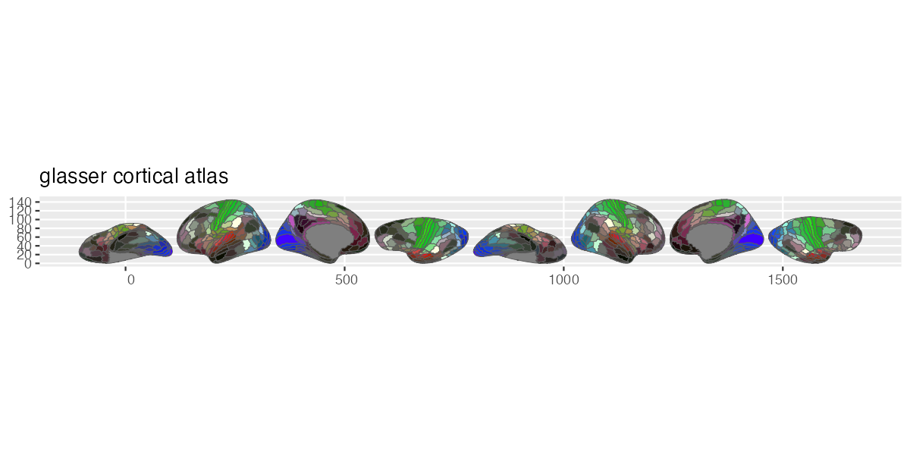

# ggsegGlasser

Glasser Atlas for the ggsegverse Ecosystem.

## Installation

``` r
# install.packages("remotes")
remotes::install_github("ggsegverse/ggsegGlasser")
```

## Usage

``` r
library(ggsegGlasser)
library(ggseg)

plot(glasser()) +
  theme_brain()
```

## Atlas

### glasser

HCP Multi-Modal Parcellation with 180 regions per hemisphere (Glasser et al., 2016).


