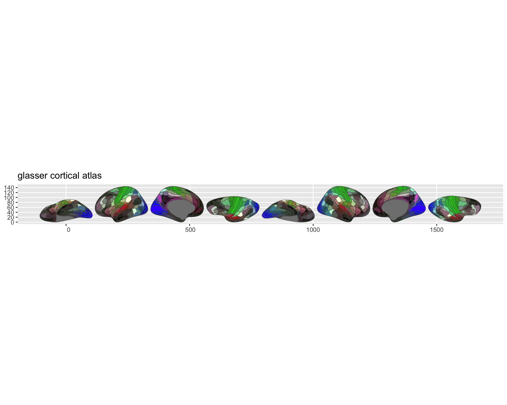

<!-- README.md is generated from README.qmd. Please edit that file -->

# ggsegGlasser 

<!-- badges: start -->

[](https://zenodo.org/badge/latestdoi/250278991)
[](https://github.com/ggsegverse/ggsegGlasser/actions/workflows/R-CMD-check.yaml)
<!-- badges: end -->

This repository contains an R package with atlas data for ggseg and
ggseg3d for the Glasser parcellation for HPC.

Glasser et al. (2016) Nature, volume 536, pages 171-178
[pubmed](https://www.nature.com/articles/nature18933)

To learn how to use these atlases, please look at the documentation for
[ggseg](https://ggseg.github.io/ggseg/) and
[ggseg3d](https://ggseg.github.io/ggseg3d).

## Installation

We recommend installing the ggseg-atlases through the ggseg
[r-universe](https://ggseg.r-universe.dev/ui#builds):

``` r
options(
  repos = c(
    ggseg = "https://ggseg.r-universe.dev",
    CRAN = "https://cloud.r-project.org"
  )
)

install.packages("ggsegGlasser")
```

And the development version from [GitHub](https://github.com/) with:

``` r
# install.packages("remotes")
remotes::install_github("ggseg/ggsegGlasser")
```

## Example

``` r
library(ggseg)
library(ggsegGlasser)

plot(glasser())
```



``` r
library(ggseg3d)

ggseg3d(atlas = glasser()) |>
  pan_camera("right lateral")
```


## Data source

HCP-MMP1 annotation files (fsaverage space, resampled to fsaverage5).

- **Reference**: Glasser et al. (2016)
  [doi:10.1038/nature18933](https://doi.org/10.1038/nature18933)
