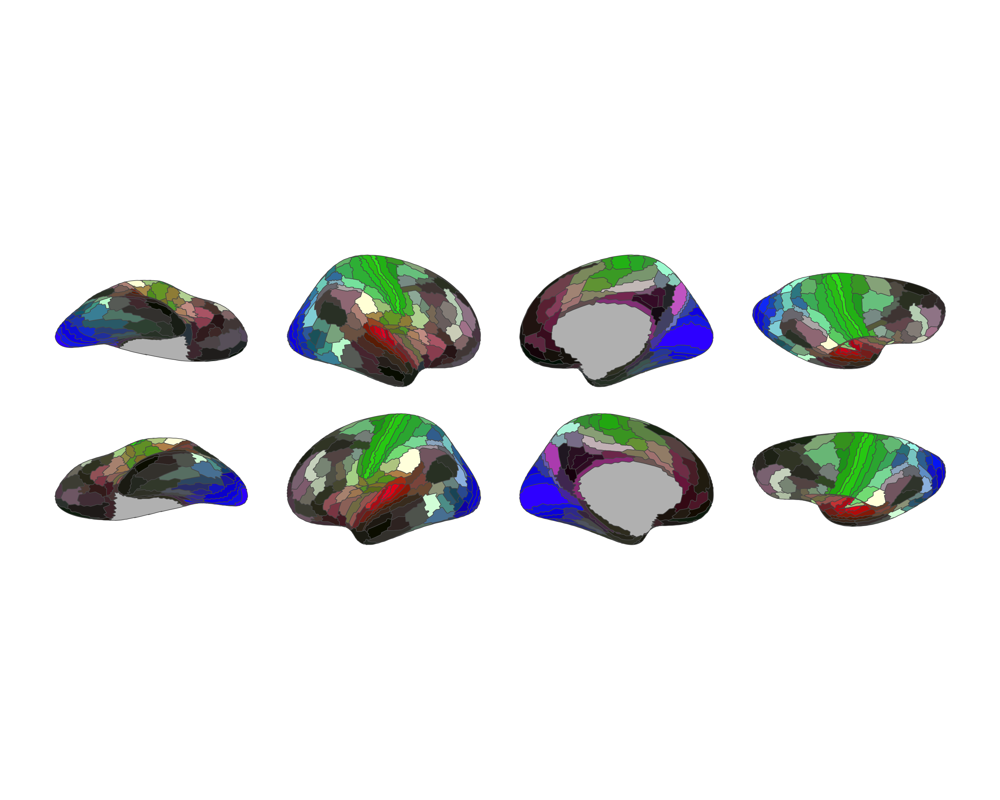

# ggsegGlasser

This repository contains an R package with atlas data for ggseg and
ggseg3d for the Glasser parcellation for HPC.

Glasser et al. (2016) Nature, volume 536, pages 171-178
[pubmed](https://www.nature.com/articles/nature18933)

To learn how to use these atlases, please look at the documentation for
[ggseg](https://ggseg.github.io/ggseg/) and
[ggseg3d](https://ggseg.github.io/ggseg3d).

## Installation

We recommend installing the ggseg-atlases through the ggseg
[r-universe](https://ggseg.r-universe.dev/ui#builds):

``` r
options(repos = c(
  ggseg = "https://ggseg.r-universe.dev",
  CRAN = "https://cloud.r-project.org"
))

install.packages("ggsegGlasser")
```

You can install the released version of ggsegGlasser from
[CRAN](https://CRAN.R-project.org) with:

``` r
install.packages("ggsegGlasser")
```

And the development version from [GitHub](https://github.com/) with:

``` r
# install.packages("remotes")
remotes::install_github("ggseg/ggsegGlasser")
```

## Example

``` r
library(ggseg)
library(ggsegGlasser)
library(ggplot2)

ggplot() +
  geom_brain(
    atlas = glasser(),
    mapping = aes(fill = label),
    position = position_brain(hemi ~ view),
    show.legend = FALSE
  ) +
  scale_fill_manual(values = glasser()$palette, na.value = "grey") +
  theme_void()
```



``` r
library(ggseg3d)

ggseg3d(atlas = glasser()) |>
  pan_camera("right lateral")
```


Please note that the ‘ggsegGlasser’ project is released with a
[Contributor Code of
Conduct](https://ggsegverse.github.io/ggsegGlasser/CODE_OF_CONDUCT.md).
By contributing to this project, you agree to abide by its terms.
