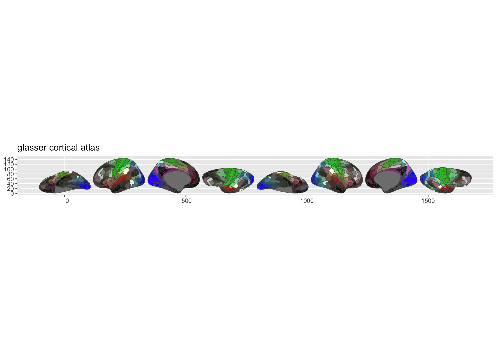

# ggsegGlasser

Glasser Atlas for the ggsegverse Ecosystem.

## Installation

``` r
# From r-universe
install.packages("ggsegGlasser", repos = "https://ggsegverse.r-universe.dev")

# From GitHub
# install.packages("remotes")
remotes::install_github("ggsegverse/ggsegGlasser")
```

## Atlases

### glasser

HCP Multi-Modal Parcellation with 180 regions per hemisphere.

``` r
library(ggsegGlasser)
plot(glasser())
```

 \## Data source

HCP-MMP1 annotation files (fsaverage space, resampled to fsaverage5).

- **Reference**: Glasser et al. (2016)
  [doi:10.1038/nature18933](https://doi.org/10.1038/nature18933)

- **Date obtained**: 2020-11-18
